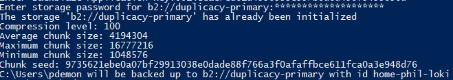
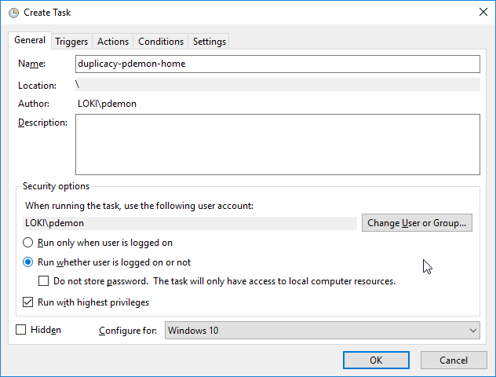

# Installation

1. Download the latest binary version from [github](https://github.com/gilbertchen/duplicacy/releases).
1. Create a bin directory in your home.

    ```powershell
    New-Item -Path "${home}\bin" -Type Directory
    ```
1. Ensure this directory is in your path.

    ```powershell
    $new_path = "${home}\bin"
    $current_path = [Environment]::GetEnvironmentVariable("Path",
        [EnvironmentVariableTarget]::User)
    $new_pattern = [regex]::Escape($new_path)
    if ($current_path -notmatch $new_pattern) {
        Write-Host "Adding '${new_path}' to User Path"
        [Environment]::SetEnvironmentVariable(
           "Path",
            "${current_path};${new_path}",
            [EnvironmentVariableTarget]::User)
    }
    ```
1. Copy the binary to this bin directory and create a symlink for `duplicacy.exe`.

    ```powershell
    $latest = "duplicacy_win_x64_2.5.2.exe"
    Copy-Item "${home}\Downloads\${latest}" "${home}\bin"
    cd "${home}\bin"
    New-Item -Type SymbolicLink -Path "duplicacy.exe" -Value ".\${latest}"
    ```

# Backup Directory Configuration

Note that this is the same process for attaching another machine to the same repository. By using different snapshot IDs for each machine you can get extra storage savings without crossing the metadata streams...

1. Initialize the repository. This command has two mandatory arguments, the snapshot ID (basically the name of the backup set) and the target. I'm using b2

    ```powershell
    # duplicacy init -e <snapshot ID> b2://<bucket name>
    $snapshot = "home-$(whoami)-$(hostname)".Replace('\','-')
    $bucket = "duplicacy-primary"
    cd $HOME
    duplicacy init -e "${snapshot}" "b2://${bucket}"
    ```
1. You'll be prompted for your Backblaze Account ID as well as your Application Key. Finally, you'll be prompted for an encryption password to actually encrypt the data. 
    
    
1. At this point the `.duplicacy` directory should have been created in your profile directory. Download the [filters](./filters) file and place it within that directory.


    ```powershell
    mv ~/downloads/filters "${HOME}/.duplicacy"
    ```
1. Finally, you need to run at least one backup to get the encryption password stored so the system can use it for subsequent executions.

    ```powershell
    # Note that '-vss' won't work unless you ran this session as an administrator
    duplicacy backup -hash -threads 8 -stats -vss
    ```


# Scheduled Task Creation

1. Open windows task scheduler and right click on the library and choose **Import Task...**.
2. Import the XML file included for reference.
3. Change the run option to **Run whether user is logged on or not**.

    
4. Update the start-in directory of the **Start a program** action under the actions tab to the location of your repository.
5. Save and enter your credentials.
6. Enable the task by right clicking on it.
7. Run it - make sure it all goes well.
